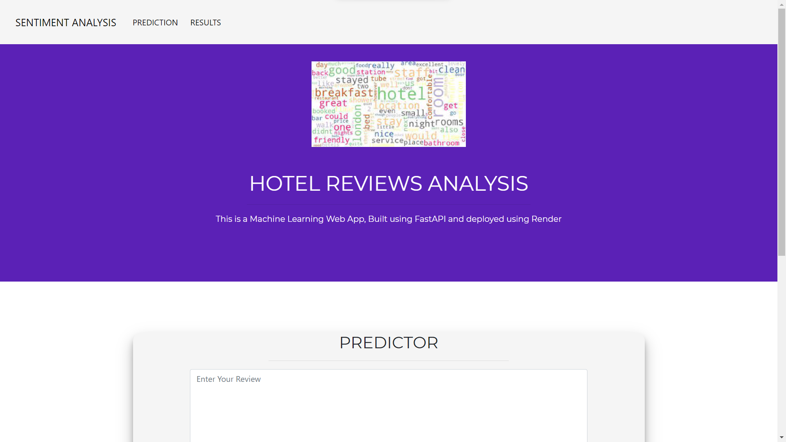
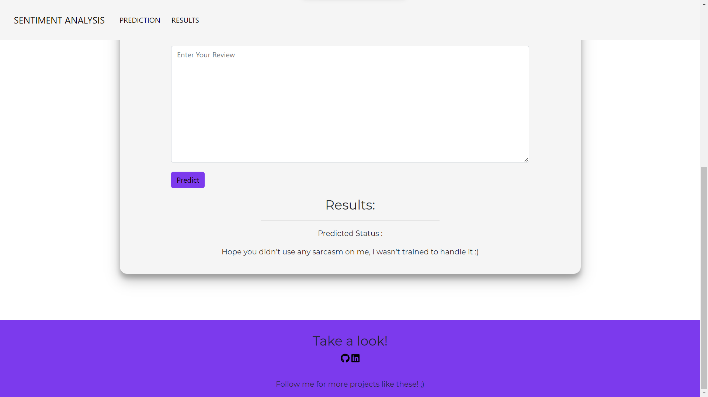
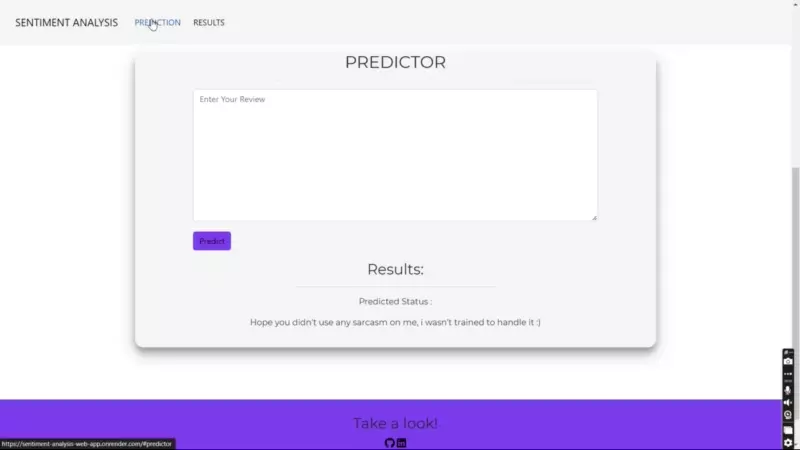

# Sentiment-Analysis-web-app
Sentiment Analysis hotel review app is used to sentiment(Positive/negative) of the review left by the customer. Created using python's scikit-learn, nltk, Fastapi, numpy and joblib packages.


## Dataset Description

The dataset consist of one predictor (independent) variable, Review and one target (dependent) variable, Liked.

The data contains the following columns:

| Feature Name               | Feature Description                                                                                 |
| -------------------------- | --------------------------------------------------------------------------------------------------- |
| Review                     | Review of the hotel left by the customer(text)                                                      |
| Liked                      | Positive/Negative(1/0)                                                                              |


## Installation

Open Anaconda prompt and create new environment

```
conda create -n your_env_name python = (any_version_number > 3.11.0)
```

Then Activate the newly created environment

```
conda activate your_env_name
```

Clone the repository using `git`

```
git clone gh repo clone Baktho-SN/Sentiment-Analysis-web-app
```

Change to the cloned directory

```
cd <directory_name>
```

To install all requirement packages for the app

```
pip install -r requirements.txt
```

Then, Run the app

```
uvicorn main:app --reload
```

## 📷 Screenshots

### Website




### Demo


